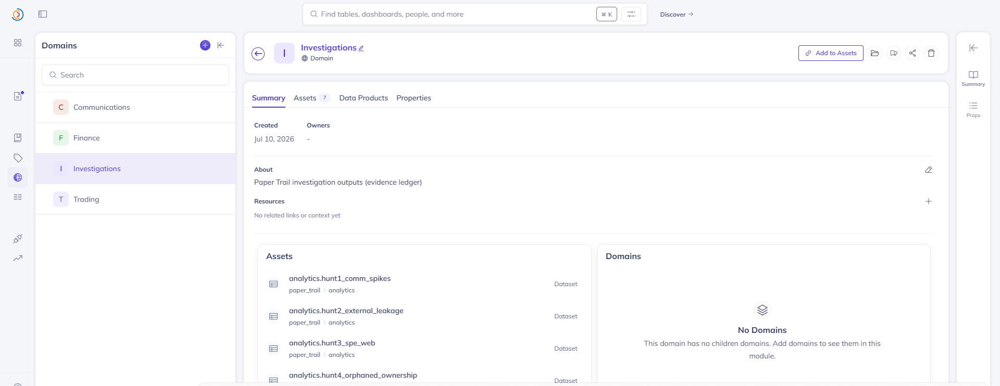
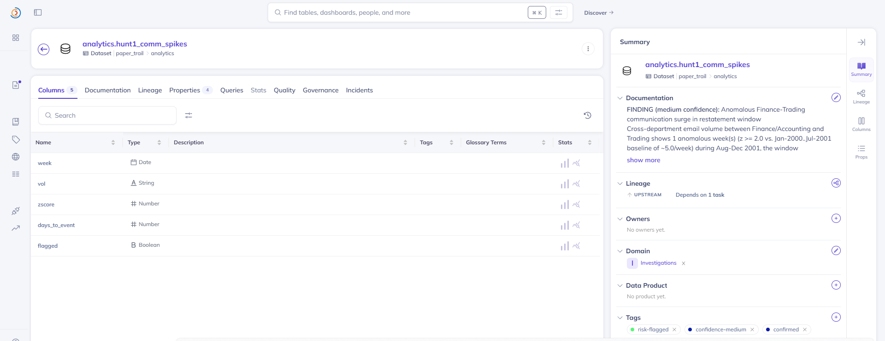
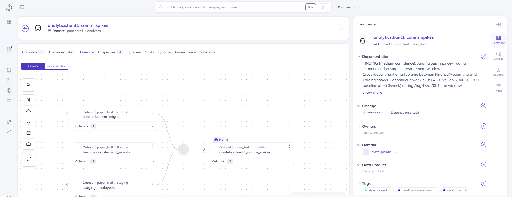
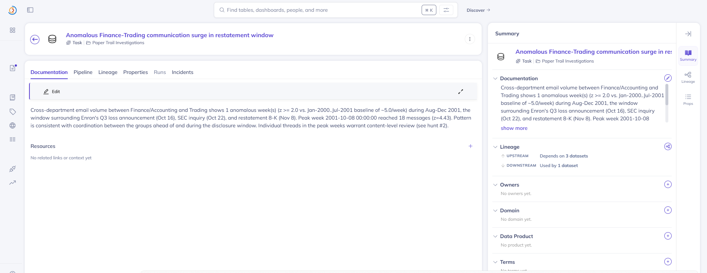
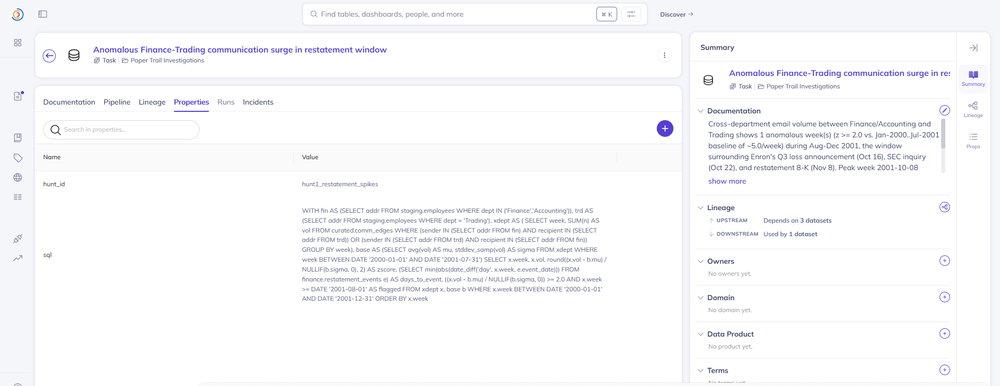
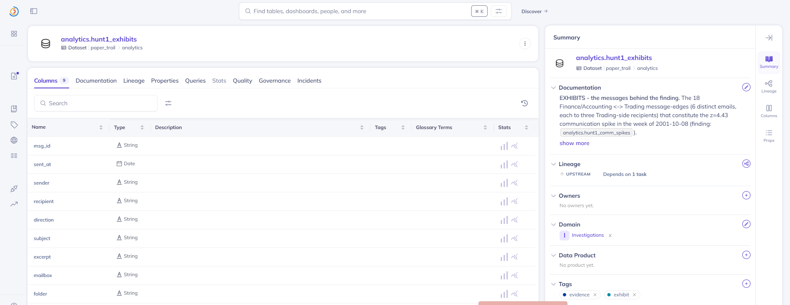
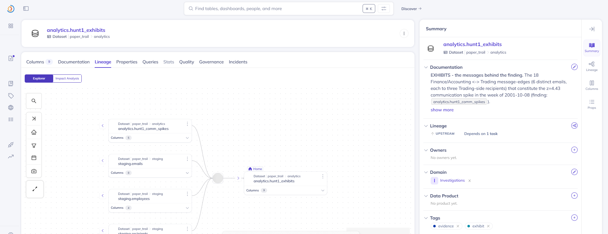
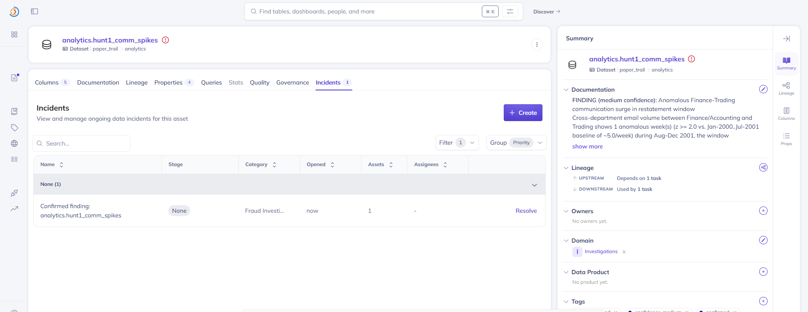
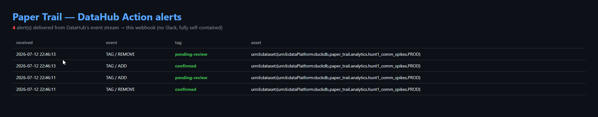
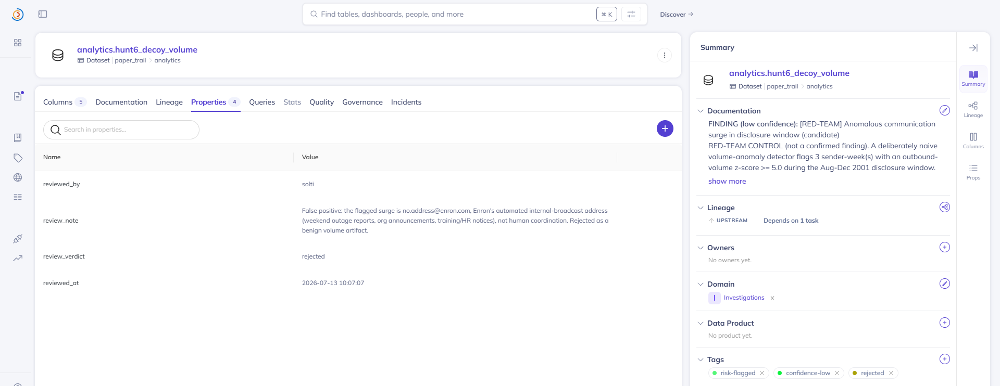

# Paper Trail

**Paper Trail turns AI investigations into auditable, reviewable metadata with
end-to-end chain of custody.** It works the real, public Enron email corpus like
a forensic team and writes every conclusion back into DataHub as a walkable
evidence trail — click any finding and trace it through the exact SQL,
intermediate datasets, and source tables down to the individual raw emails that
triggered it. No black-box verdicts.

A traditional catalog *describes* data. Paper Trail turns *investigations* into
governed metadata that can be reviewed, audited, challenged, and **acted upon**.

Built for **"Build with DataHub: The Agent Hackathon"** (2026). Apache 2.0.

> **Guided autonomy with deterministic guardrails.** A local agent investigates and
> writes findings back; a reproducible verification layer — five scripted hunts plus a
> golden gate — makes every finding auditable and reproducible. What's real vs.
> reconstructed, the exact numbers, the planted red-team control, and the honest limits
> are on one page: **[GROUND_TRUTH.md](GROUND_TRUTH.md)**.

---

## The problem

AI findings are worthless in audit, compliance, and legal contexts without
provenance. "The model flagged it" is not admissible; a chain of custody is.
A metadata graph is exactly a chain-of-custody machine — Paper Trail treats
investigations as first-class metadata.

## The pattern

Every hunt terminates in an **evidence-provenance ledger entry**:

- an **evidence Dataset** — the finding materialized as a real table,
  registered in DataHub with hypothesis, method, and thresholds
- a **DataJob** — holding the *verbatim* SQL that produced it, with input
  lineage to every source table touched
- **tags** — `evidence` + `pending-review`; a human reviewer flips to
  `confirmed`/`rejected`, and the verdict (who/when/why) is stamped into the
  entity's properties. Confirming also raises a **native DataHub Incident** on
  the asset, so the case's live state is in DataHub itself, not just a tag.

**The money shot:** in the DataHub UI, open a finding → evidence dataset →
lineage tab → DataJob (SQL visible) → staging tables → raw mailbox files.
Five clicks from accusation to evidence.

## What it looks like in DataHub

The walk below is the actual product of a hunt — real entities written to a
live DataHub instance, not mockups. This is hunt #1 (restatement-window
communication spikes).

**1 · The evidence ledger.** Every hunt's output lands in the `Investigations`
domain — each finding a first-class, catalogued asset.



**2 · The finding as an evidence dataset.** The hypothesis, method, and
thresholds live in the description; the review state is carried by tags
(`risk-flagged` · `confidence-medium` · `confirmed`) and glossary terms
(`RestrictedPeriod`, `FinanciallyMaterial`).



**3 · Walkable lineage.** The finding traces back through its producing task to
the three source tables it touched (`curated.comm_edges`,
`finance.restatement_events`, `staging.employees`).



**4 · The producing task.** A DataJob holds the method narrative and its
upstream/downstream lineage — "depends on 3 datasets, used by 1 dataset."



**5 · The verbatim SQL.** The exact query that produced the finding is stored
on the task, byte-for-byte — reproducible, auditable provenance. This is what
turns "the model flagged it" into a chain of custody.



**6 · The exhibits - the actual messages.** The trail doesn't stop at the SQL.
The producing task has a sibling *exhibits* dataset holding the individual
messages behind the number: the 18 Finance/Accounting <-> Trading edges (6
distinct emails) that make up the z=4.43 week - real messages from **Jeffrey
McMahon (Treasurer)** to **David Delainey, Louise Kitchen, and John Lavorato**
(the heads of the trading businesses), subject *"2002 Corporate Allocations to
EIM"*, eight days before the Oct-16 loss announcement.



**7 · Five clicks from accusation to the raw email.** The exhibits' lineage
closes the loop: the finding *and* `staging.emails` both feed the extraction
task that produced them, so from any finding you can walk down to the specific
messages and on to the raw corpus. Not a black-box verdict - a chain of custody
that ends where the evidence actually lives.



**8 · The review closes the loop - DataHub *acts*.** Confirming a finding in the
human-review step raises a native DataHub **Incident** on the **implicated
production asset** — not the evidence table, the real dataset under suspicion.
For the ownership-forensics hunt that's the three restatement-implicated finance
tables (`finance.executive_summary_report`, `finance.restatement_events`,
`finance.spe_entities`); each gets a red *Fraud Investigation* badge opened by
the reviewer. The raise is **idempotent** (re-running returns the same incident,
never a duplicate), and the lifecycle is real: **rejecting or reopening** a
finding **resolves** the incidents it opened, with the reason recorded. The
investigation's state now lives in DataHub's own "this asset is under
investigation" primitive — metadata stops being a passive log and becomes the
system of record for the case.



## The value gate is a native DataHub Assertion

The same golden gate that guards CI is also published *into* DataHub as native
**custom Assertions** — one per evidence dataset, living in the asset's
Validation tab (`python ingest/emit_assertions.py`). Each assertion re-derives
the hunt's headline numbers from the warehouse and reports **SUCCESS / FAILURE**
with every individual check attached as a result property, so a value regression
(the z-score silently drifting off 4.43) surfaces as a *failing assertion on the
data itself* — sitting next to freshness and volume checks, not buried in a CI
log. Verified end-to-end: **20/20 checks across six evidence datasets report
green** (`upsertCustomAssertion` + `reportAssertionResult`, idempotent by URN).
This is the golden gate ported from a script the judges run to a first-class
DataHub validation signal the catalog carries.

## Event-driven: DataHub *fires actions*, not just stores state

The incident isn't the end of the loop. A custom **DataHub Action** (`actions/`)
runs inside the `datahub-actions` container, subscribes to DataHub's own Kafka
event stream, and fires a webhook the moment a review tag changes on an asset.
Confirm a finding and the alert is delivered end-to-end through DataHub's event
bus — no polling, no Slack, fully self-contained:



Run it: `python actions/pt_webhook_receiver.py` on the host, then
`datahub actions -c actions/pt_pipeline.yml` inside the actions container. This
is the difference between metadata as a *logbook* and metadata as a *control
plane* — a confirmed finding or a raised incident can now **trigger work**.

## The review rejects false positives (red-team control)

An "auditable investigator" is only trustworthy if it can also say *no*.
`hunts/hunt6_decoy_volume.py` is a planted control: a deliberately naive volume
detector that flags the single biggest communication surge in the disclosure
window — **1,399 messages the week of the SEC inquiry (Oct 22 2001), z=6.6**. On
its face that looks like coordinated activity. It isn't: the sender is
`no.address@enron.com`, Enron's automated internal-broadcast address (weekend
outage reports, org announcements, training notices). A human reviewer
**rejects** it, and the rejection — who, when, and why — is stamped into the
ledger exactly like a confirmation:



So the pipeline doesn't just confirm what it's fed — it flags candidates and the
human filters the false positives, and a *rejection* is first-class auditable
metadata, not a silent delete. That's the difference between a demo that only
finds what was planted and a review process with teeth.

## Why not just lineage?

Lineage tells you _what_ connects to _what_. An evidence ledger also answers _why a finding exists_: the hypothesis and thresholds live in the evidence dataset's description, the **verbatim SQL** that produced it lives in the DataJob, _who approved it and when_ is stamped into properties on review, and _how the case evolved_ is visible across runs. Ordinary catalog lineage can't answer "who signed off on this, and on what basis?" — a chain of custody can. That's the difference between metadata as documentation and metadata as evidence.

## The five hunts

Hunts **1–2 are discoveries on the real, public Enron corpus**. Hunts **3–5
demonstrate the governance-audit capability** over `finance.*` tables that are
reconstructed from the public Enron record and labeled as such in DataHub (see
[Honest labeling](#honest-labeling) and `docs/ground_truth.md`). The contribution
is the auditable *pattern* a human can review and challenge — not the
reconstructed tables.

| # | Hunt | Finding |
|---|------|---------|
| 1 | Restatement-window comm spikes | z=4.43 volume anomaly the week of Oct 8 2001 — 8 days before Enron's Oct 16 Q3-loss announcement (18 msgs vs ~5/wk) |
| 2 | Material-info leakage | 120 pre-disclosure emails referencing undisclosed SPEs reached 43 external addresses — top domains aol.com (personal webmail), velaw.com + cwt.com (outside counsel), swbell.net |
| 3 | SPE shadow web | 8 shadow vehicles co-mentioned heavily with known SPEs but absent from the glossary (marlin, osprey, talon, yosemite, rawhide, fishtail, condor, porcupine) — all real Enron entities |
| 4 | Orphaned ownership | 3 financially-material datasets owned by implicated, departed officers (Fastow, Causey); none certified |
| 5 | Provenance gaps | The same 3 datasets have zero documented lineage — the meta-hunt: finding fraud in data *governance* itself |

Corpus: 435,259 parsed emails (CMU Enron corpus, May 2015 release) in DuckDB,
with a full metadata model — ownership, glossary, domains, lineage, and
deliberate governance defects — bootstrapped into DataHub.

## Architecture

Two ways to run the same investigation — both write the same ledger:

- **Deterministic mode** — five scripted hunts (`hunts/hunt1–5.py`), each moving through the phases below. Reproducible, no LLM; `verify_hunts.py` walks every trail end-to-end (→ VERIFY_PASS).
- **LLM mode** — a single **LangGraph ReAct agent** (`agents/graph.py`) on a local open model (qwen3-30b-a3b via Ollama), driven by a system prompt that enforces the same phases and an "evidence or silence" rule. Guardrails (argument-coercion hook, retry wrapper, repeat-loop-breaker, turn-budget nudge) keep the local model reliable at MCP tool-calling.

The phases every investigation moves through:

```
 Ground   metadata first: search, schemas, tags, glossary, query context
 Analyze  metadata-grounded SQL -> DuckDB -> statistical checks
 Trace    lineage traversal: blast radius, provenance verification
 Scribe   write findings back: evidence Datasets + DataJobs + lineage
          (acryl-datahub SDK; MCP mutations can't create these entities)
 Review   human flips pending-review -> confirmed/rejected (CLI or DataHub UI)
```

Stack: DataHub OSS quickstart (Docker) · `mcp-server-datahub` (mutations
enabled) · DuckDB warehouse · LangGraph + a local open model (qwen3-30b-a3b
via Ollama; provider-swappable via env) · Streamlit case board.

**Guided autonomy, with deterministic guardrails.** The agent is not a scripted ETL wrapper. Given only a prose brief, the local 30B independently searches the catalog, writes its own SQL, and records a finding — and `agents/run_gate.py` proves it end-to-end: drop the evidence table and the agent **rebuilds it from scratch**, its output passing `verify_golden` **20/20**, landing the right anomaly week at z≈4.5 from the brief alone (the small gap from the canonical 4.43 is the gate doing its job, not the agent guessing). Point it the *other* way — `agents/run_blind.py`, undirected, schema only, no method — and it surfaces real issues it was never told to look for (corrupted timestamps; a top sender missing from the employee registry); the full trace, stumbles included, is in [`docs/blind_test_log.md`](docs/blind_test_log.md). That is real, checkable agency. What makes that agency *auditable* — safe to put in front of a regulator — is the deterministic layer beneath it. The five scripted hunts plus two gates are the **reproducible verification layer**: `verify_hunts.py` checks every trail is *shaped* right (evidence dataset → DataJob with SQL → lineage), and **`verify_golden.py` re-derives every headline number from the warehouse** (z=4.43 the week of Oct 8, the 6 exhibit messages, 120 leaked emails to 43 external addresses, the 8 shadow vehicles, the Fastow/Causey datasets) and asserts each against a checked-in golden, so a silent drift in any hunt's logic fails the gate. Because the agent and the hunts write the *same* evidence tables, the golden gate certifies whichever produced them — a passing agent has to reproduce the checked truth, byte for byte. The hunts don't replace the agent; they are the guardrail that turns its autonomy into evidence you can defend in an audit. (A local 30B is best-effort under sustained load — which is precisely why the guardrails exist: *guided autonomy with deterministic guardrails* is the design that makes an AI investigator admissible.)

**Reproduce it without a GPU or DataHub.** You don't need the 435K-email warehouse to check the headline claims. A 3 MB fixture (`data/fixture_warehouse.duckdb`) ships the evidence ledger plus exactly the source rows hunt-1 reads, and on **every push CI** (`.github/workflows/ci.yml`) recomputes z=4.43 from that source and asserts all 20 golden numbers. Run it yourself:

```bash
PAPER_TRAIL_WAREHOUSE=data/fixture_warehouse.duckdb python ingest/recompute_hunt1.py  # -> RECOMPUTE_PASS (z=4.43 re-derived from source)
PAPER_TRAIL_WAREHOUSE=data/fixture_warehouse.duckdb python ingest/verify_golden.py     # -> GOLDEN_PASS (20/20)
```

## Quickstart

```bash
# 1. DataHub quickstart (needs ~8GB Docker RAM); UI at localhost:9002
datahub docker quickstart

# 2. Python env (Python 3.11+)
python -m venv .venv && .venv/Scripts/pip install -r requirements.txt

# 3. Warehouse + metadata bootstrap (schemas, owners, glossary, lineage, defects)
python ingest/build_warehouse.py
python ingest/datahub_bootstrap.py

# 4. Run the hunts
python hunts/hunt1_restatement_spikes.py   # ... through hunt5

# 5. Verify every paper trail end-to-end
python ingest/verify_hunts.py              # → VERIFY_PASS  (shape: dataset+SQL+lineage)
python ingest/verify_golden.py             # → GOLDEN_PASS  (values: z=4.43, 120/43, ...)
python ingest/emit_assertions.py           # → ASSERTIONS_OK (publish the gate as native DataHub assertions)

# 6. Review findings (the HITL step). accept raises a native Incident on the
#    implicated asset; reject/reopen resolves it — the full lifecycle.
python -m agents.reviewer list
python -m agents.reviewer accept hunt3 --note "verified against public record"
python -m agents.reviewer reopen hunt3     # resolves the incident + returns to pending

# 7. Case board
python -m streamlit run ui/case_board.py
```

LLM-driven investigation (optional; hunts run deterministically without it):
start Ollama with `qwen3:30b-a3b-instruct-2507-q4_K_M`, then run
`python -m agents.graph "<your directive>"`. Fully local — no API key.
(Provider-swappable to any OpenAI-compatible endpoint via env.)

## Repo layout

```
paper-trail/
├── ingest/        # warehouse build, DataHub bootstrap, smoke tests, verification
├── agents/        # LangGraph ReAct agent, reviewer CLI, SDK/metadata helpers
├── hunts/         # the five hunt definitions (method + thresholds + emission)
├── ui/            # Streamlit case board
├── examples/      # generated SQL, ledger entries, lineage screenshots
├── skill/         # datahub-investigate skill (upstreamed: datahub-skills PR #34)
└── docs/          # build plan, demo script
```

## OSS contribution

The investigation pattern is packaged as a reusable agent skill —
`datahub-investigate` — submitted upstream:
[datahub-project/datahub-skills#34](https://github.com/datahub-project/datahub-skills/pull/34).

## Honest labeling

Email data is real and public (CMU Enron corpus). The `finance.*` tables
(transactions, SPE entities, restatement events) are **reconstructed for
demo** from the public record and labeled as such in their DataHub
descriptions. The hunts' entity names, dates, and disclosure windows follow
the historical record — see [`docs/ground_truth.md`](docs/ground_truth.md) for the
finding-by-finding mapping to the documented Enron case (Fastow/Causey, the real
SPEs, the real timeline).

## License

Apache 2.0 — see [LICENSE](LICENSE).
